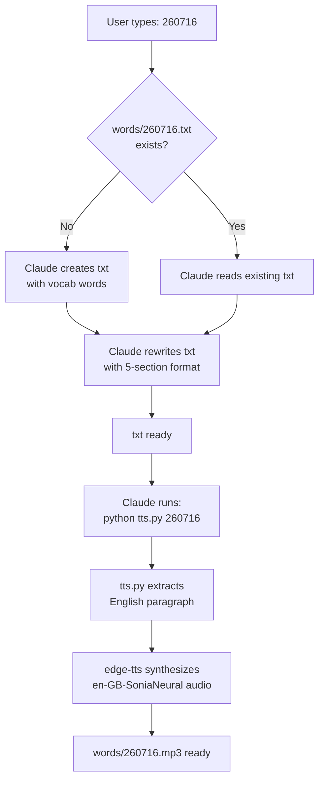

# Date-Driven IELTS Workflow

> Turn a 6-digit date code into an IELTS speaking/writing practice paragraph — with native-sounding audio — in one shot. Zero clicks after the first prompt.

## What is this?

A **Claude Code** workflow that helps you practice IELTS vocabulary every day. Give Claude a date code (like `260716`) and it:

1. Picks a fresh topic with 6–8 Chinese vocabulary words
2. Writes a polished IELTS-band paragraph weaving all words together
3. Generates native English audio via Microsoft Edge TTS (free)

The entire interaction is **zero-interaction** — type the number, wait a minute, and you have a `.mp3` ready to shadow.

## Quick Start

```bash
# 1. Install dependencies
pip install -r requirements.txt

# 2. Copy CLAUDE.md to your project root (where you open Claude Code)

# 3. In Claude Code, type:
260716
```

That's it. The file `words/260716.txt` and `words/260716.mp3` will be created in your working directory.

## How it Works



### The 5-section txt format

`tts.py` parses this format with regex — **keep section titles exactly as shown**:

```
原始词汇
==========
1  量化投资
2  风险对冲
...

单词翻译
==========
量化投资  quantitative investing
...

英文背诵段落
==========
Quantitative investing has fundamentally reshaped modern finance...

中文对照
==========
量化投资通过运用数学模型...

重点短语
==========
quantitative investing — 量化投资
...
```

Only the text under `英文背诵段落` is read aloud — the rest is for your reference.

## Example

See [examples/260716/](examples/260716/) — a full sample on **quantitative investing**:

| File | Description |
|---|---|
| [260716.txt](examples/260716/260716.txt) | Full 5-section vocab + paragraph |
| [260716.mp3](examples/260716/260716.mp3) | ~1 min British English audio (417 KB) |

## Customization

### Change the voice

```bash
python tts.py 260716 --voice en-US-AriaNeural --rate -10%
```

| Voice | Accent |
|---|---|
| `en-GB-SoniaNeural` | British (default) |
| `en-GB-RyanNeural` | British male |
| `en-US-AriaNeural` | American |
| `en-US-GuyNeural` | American male |

[Full voice list →](https://learn.microsoft.com/en-us/azure/ai-services/speech-service/language-support?tabs=tts#text-to-speech)

### Change your topic rotation

Edit the topic list in `CLAUDE.md` under `仅数字编号（自选主题）` — AI will rotate through your domains daily.

## Requirements

- Python 3.8+
- [edge-tts](https://github.com/rany2/edge-tts) (free, no API key needed)
- [Claude Code](https://claude.ai/code)

## License

MIT — see [LICENSE](LICENSE).
